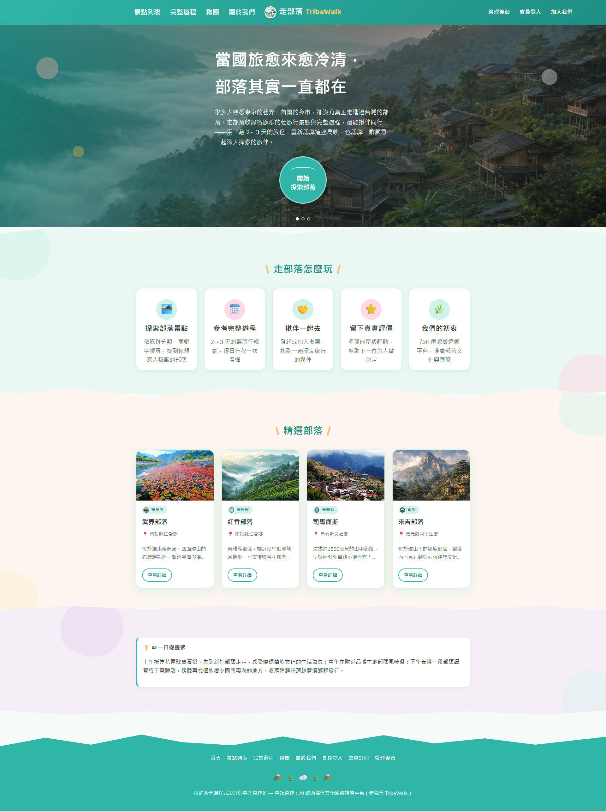
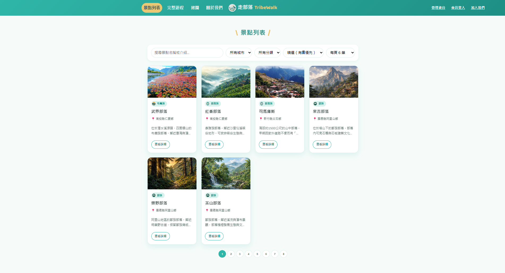
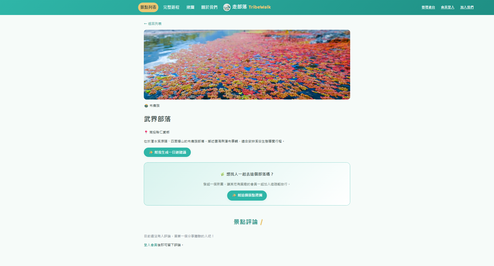
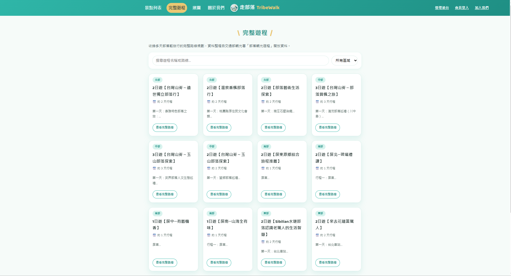
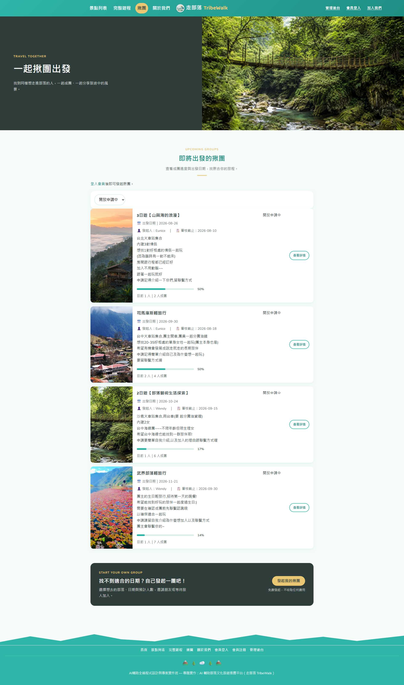
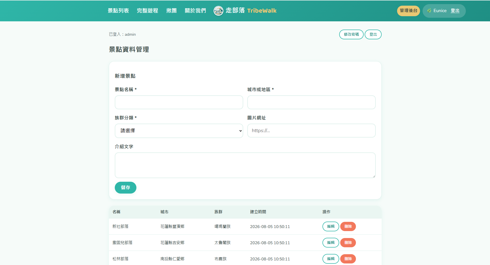
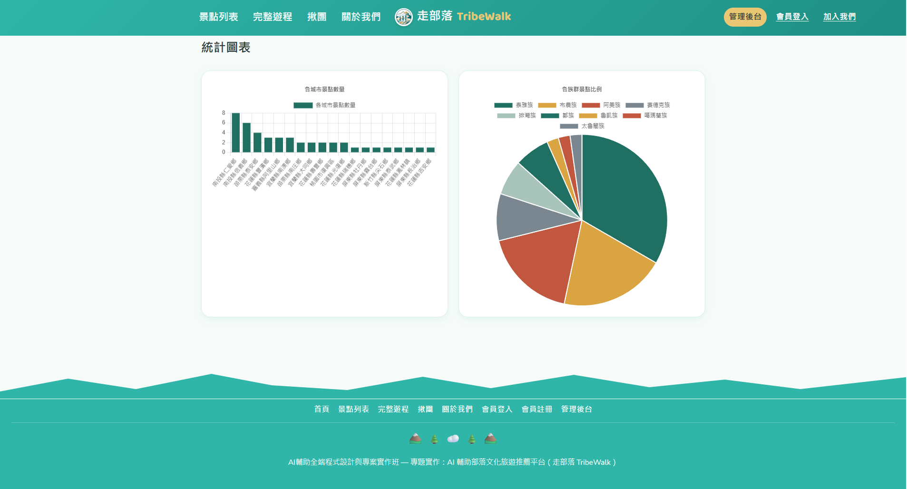
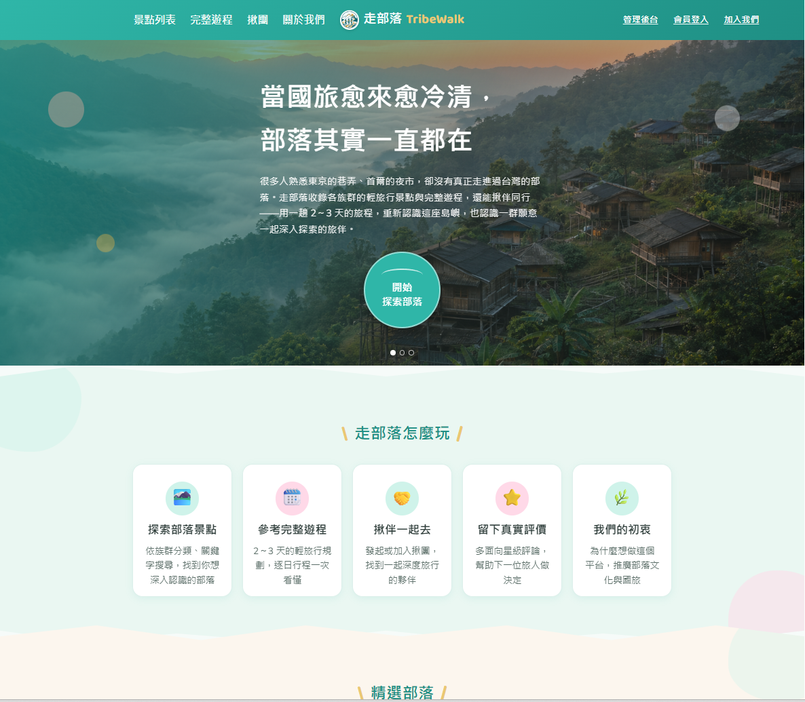
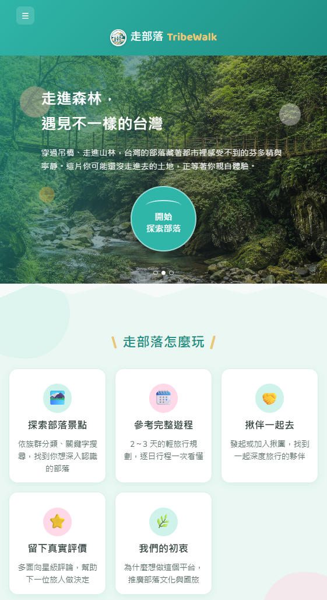
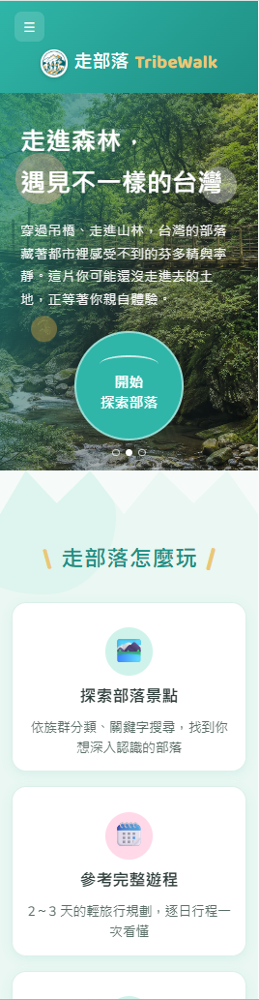

# 走部落 TribeWalk — AI 輔助部落文化旅遊推薦平台

## 專題簡介
許多台灣民眾旅遊時習慣前往日本、韓國、東南亞，相對之下，國內原住民族部落所擁有的
生活文化、傳統工藝、飲食與山林智慧，反而較少被一般旅客認識或親自體驗。

「走部落 TribeWalk」希望從部落文化體驗的角度出發，整理台灣各族群的部落輕旅行地點，
讓使用者發現不同於一般觀光行程的旅遊選擇，重新認識台灣、也順帶推廣國內旅遊。

網站整合前端頁面、部落景點資料 CRUD、AI 輔助內容與簡易資料視覺化，
並支援關鍵字搜尋、族群分類篩選、排序與分頁。

## 使用技術
- 前端：HTML5、CSS3、原生 JavaScript（Fetch API）、Chart.js
- 後端：PHP（PDO）
- 資料庫：SQLite（本機開發用，可自行換成 MySQL）
- 版本控制：Git / GitHub

## 系統功能說明
| 功能 | 說明 |
|---|---|
| 首頁 | 大幅面景點圖片輪播主視覺、精選部落、AI 一日遊靈感 |
| 關於我們 | 網站創辦初衷與理念說明 |
| 景點列表 | 關鍵字搜尋、族群分類篩選、城市篩選、排序、分頁 |
| 景點詳細頁 | 顯示部落完整資訊，並可即時產生 AI 一日遊建議 |
| 完整遊程 | 瀏覽多天部落輕旅行的完整路線規劃，可依區域篩選、搜尋 |
| 遊程詳細頁 | 依「第X天」自動拆解路線文字，逐日呈現行程內容 |
| 管理後台 | 需登入才能使用；新增／編輯／刪除部落景點與完整遊程（含欄位檢查與操作回饋）、統計圖表、修改密碼 |
| 會員系統 | 一般訪客可註冊、登入，跟管理後台的管理員帳號是分開的系統 |
| 景點評論 | 會員可對部落景點留下 5 個面向的星級評分（景觀環境／文化真實性／交通可及性／性價比／整體推薦）+ 文字 + 照片／影片連結 |
| 揪團 | 會員可發起部落輕旅行揪團、開放其他會員申請加入，發起人可核准／拒絕申請 |
| 旅伴互評 | 揪團出發日期過後，已核准的旅伴之間可互相評價（準時可靠／溝通互動／尊重禮貌／整體體驗） |
| 揪團聯繫方式 | 發起人可留下 Discord／Line 等聯繫方式，只有發起人與已核准成員看得到 |
| 揪團留言板 | 開放給所有登入會員留言討論（不限已核准成員），支援針對特定留言個別回覆，發起人的回覆會標示「🌿 團主」；讓還沒申請或申請中的人也能先跟發起人互動，真正的聯繫方式仍只有已核准成員看得到 |
| 申請加入需自我介紹 | 申請加入揪團時須填寫自我介紹、加入原因與對行程的想法，供發起人審核判斷；發起人可設定審核截止日，讓申請者知道大概何時會有結果 |

> 會員／評論／揪團／旅伴互評是評量 15 項項目之外的延伸功能，用來練習更完整的全端應用情境。

功能畫面與 RWD 三種寬度（1200px／768px／375px）截圖都已放在下方「專案畫面截圖」章節。

## 資料庫設計說明

本專題使用 SQLite，資料庫檔案為 `database/travel.sqlite`。詳細建表語法見 [`database/schema.sql`](./database/schema.sql)。

### categories 族群分類資料表
| 欄位 | 型別 | 說明 |
|---|---|---|
| id | INTEGER | 主鍵，自動編號 |
| name | TEXT | 族群分類名稱（共 9 族：泰雅族、布農族、排灣族、鄒族、阿美族、賽德克族、太魯閣族、噶瑪蘭族、魯凱族） |

### attractions 部落／景點資料表
| 欄位 | 型別 | 說明 |
|---|---|---|
| id | INTEGER | 主鍵，自動編號 |
| name | TEXT | 部落／景點名稱 |
| city | TEXT | 城市或地區 |
| category_id | INTEGER | 分類編號，對應 `categories.id`（外鍵） |
| image_url | TEXT | 圖片網址 |
| description | TEXT | 部落介紹文字 |
| created_at | TEXT | 建立時間 |

### itineraries 完整遊程資料表
| 欄位 | 型別 | 說明 |
|---|---|---|
| id | INTEGER | 主鍵，自動編號 |
| name | TEXT | 遊程名稱 |
| region | TEXT | 區域 |
| route_text | TEXT | 完整路線文字（可能包含多天內容） |
| created_at | TEXT | 建立時間 |

此資料表獨立於 `attractions` 之外，用來呈現「一個遊程串連多個部落景點」的完整規劃，資料整理自政府開放資料（見下方說明）。

### admins 後台管理員資料表
| 欄位 | 型別 | 說明 |
|---|---|---|
| id | INTEGER | 主鍵，自動編號 |
| username | TEXT | 管理員帳號 |
| password_hash | TEXT | 密碼雜湊（bcrypt） |
| created_at | TEXT | 建立時間 |

只用來保護管理後台，不對外開放註冊。

### members 一般會員資料表
| 欄位 | 型別 | 說明 |
|---|---|---|
| id | INTEGER | 主鍵，自動編號 |
| username | TEXT | 會員帳號 |
| email | TEXT | 電子郵件 |
| password_hash | TEXT | 密碼雜湊（bcrypt） |
| avatar_url | TEXT | 頭像網址 |
| bio | TEXT | 自我介紹 |
| email_verified | INTEGER | 是否已驗證信箱 |
| created_at | TEXT | 建立時間 |

跟 `admins` 是分開的帳號系統。

### reviews 景點評論資料表
| 欄位 | 型別 | 說明 |
|---|---|---|
| id | INTEGER | 主鍵，自動編號 |
| member_id | INTEGER | 會員編號（外鍵，對應 `members.id`） |
| attraction_id | INTEGER | 景點編號（外鍵，對應 `attractions.id`） |
| rating_scenery / rating_culture / rating_access / rating_value / rating_overall | INTEGER | 5 個面向星級評分（1~5） |
| title | TEXT | 評論標題 |
| content | TEXT | 評論內容 |
| created_at | TEXT | 建立時間 |

### review_media 評論照片／影片資料表
| 欄位 | 型別 | 說明 |
|---|---|---|
| id | INTEGER | 主鍵，自動編號 |
| review_id | INTEGER | 評論編號（外鍵，對應 `reviews.id`） |
| media_type | TEXT | 媒體類型（image／video） |
| url | TEXT | 媒體網址 |
| created_at | TEXT | 建立時間 |

目前先用網址形式儲存，尚未接真正的檔案上傳服務。

### trip_groups 揪團資料表
| 欄位 | 型別 | 說明 |
|---|---|---|
| id | INTEGER | 主鍵，自動編號 |
| organizer_id | INTEGER | 發起人會員編號（外鍵，對應 `members.id`） |
| attraction_id / itinerary_id | INTEGER | 選填外鍵，對應景點或遊程 |
| title | TEXT | 揪團標題 |
| description | TEXT | 揪團說明 |
| departure_date | TEXT | 出發日期 |
| max_members | INTEGER | 人數上限 |
| status | TEXT | 狀態（open/full/closed/completed/cancelled） |
| created_at | TEXT | 建立時間 |

### trip_group_members 揪團成員資料表
| 欄位 | 型別 | 說明 |
|---|---|---|
| id | INTEGER | 主鍵，自動編號 |
| trip_group_id | INTEGER | 揪團編號（外鍵，對應 `trip_groups.id`） |
| member_id | INTEGER | 會員編號（外鍵，對應 `members.id`） |
| status | TEXT | 申請狀態（pending/approved/rejected） |
| joined_at | TEXT | 申請／加入時間 |

### companion_ratings 旅伴互評資料表
| 欄位 | 型別 | 說明 |
|---|---|---|
| id | INTEGER | 主鍵，自動編號 |
| trip_group_id | INTEGER | 揪團編號（外鍵，對應 `trip_groups.id`） |
| rater_id / ratee_id | INTEGER | 評分者／被評分者會員編號（皆為外鍵，對應 `members.id`） |
| rating_punctual / rating_communication / rating_respect / rating_overall | INTEGER | 4 個面向星級評分（1~5） |
| comment | TEXT | 評語 |
| created_at | TEXT | 建立時間 |

限制：只有同團「已核准」的成員、且出發日期已過，才能互相評價。

### 資料表關聯
`attractions.category_id` 外鍵對應 `categories.id`，代表每個部落景點都屬於一個族群分類；
其餘會員／評論／揪團相關資料表的外鍵關聯已標示於上方各表說明中。

## API 說明

API 成功時會回傳 `success: true`、`message` 與 `data`（資料內容）；失敗時會回傳 `success: false`、`message`（錯誤原因），並搭配對應的 HTTP 狀態碼（例如 401 未登入、404 查無資料）。

| Method | 路徑 | 說明 |
|---|---|---|
| GET | `/api/attractions.php` | 查詢列表，支援 `q`、`city`、`category_id`、`sort`、`order`、`page`、`limit` |
| GET | `/api/attractions.php?id=1` | 查詢單筆 |
| POST | `/api/attractions.php` | 新增部落景點 |
| PUT | `/api/attractions.php?id=1` | 修改部落景點 |
| DELETE | `/api/attractions.php?id=1` | 刪除部落景點 |
| GET | `/api/categories.php` | 取得族群分類清單 |
| POST | `/api/ai_travel_plan.php` | 取得 AI 一日遊建議 |
| GET | `/api/dashboard_statistics.php` | 取得統計資料（各城市/各族群數量） |
| GET | `/api/itineraries.php` | 查詢完整遊程列表，支援 `q`、`region`、`page`、`limit` |
| GET | `/api/itineraries.php?id=1` | 查詢單一遊程完整路線 |
| POST | `/api/itineraries.php` | 新增遊程 |
| PUT | `/api/itineraries.php?id=1` | 修改遊程 |
| DELETE | `/api/itineraries.php?id=1` | 刪除遊程 |
| POST | `/api/auth_login.php` | 管理員登入 |
| POST | `/api/auth_logout.php` | 登出 |
| GET | `/api/auth_check.php` | 檢查是否已登入 |
| POST | `/api/auth_change_password.php` | 修改管理員密碼（需先登入） |

> 景點與遊程的新增／修改／刪除（POST／PUT／DELETE）都需要先登入管理後台，
> 未登入呼叫會收到 401「請先登入管理後台」。查詢（GET）不需要登入，一般訪客也能瀏覽。

### 會員／評論／揪團 API（延伸功能）

| Method | 路徑 | 說明 |
|---|---|---|
| POST | `/api/member_register.php` | 會員註冊 |
| POST | `/api/member_login.php` | 會員登入 |
| POST | `/api/member_logout.php` | 會員登出 |
| GET | `/api/member_check.php` | 檢查是否已登入會員 |
| GET | `/api/reviews.php?attraction_id=1` | 查詢某景點的評論列表與平均分數 |
| POST | `/api/reviews.php` | 新增評論（需登入會員） |
| PUT/DELETE | `/api/reviews.php?id=1` | 修改／刪除自己的評論 |
| GET | `/api/trip_groups.php` | 查詢揪團列表（支援 status／attraction_id／itinerary_id） |
| GET | `/api/trip_groups.php?id=1` | 查詢單一揪團詳情（含成員名單） |
| POST | `/api/trip_groups.php` | 發起揪團（需登入會員） |
| PUT/DELETE | `/api/trip_groups.php?id=1` | 修改／刪除揪團（限發起人） |
| POST | `/api/trip_group_members.php` | 申請加入揪團 |
| PUT | `/api/trip_group_members.php?id=1&action=approve` | 核准申請（限發起人） |
| DELETE | `/api/trip_group_members.php?id=1` | 退出揪團 |
| GET | `/api/companion_ratings.php?member_id=1` | 查詢某會員收到的旅伴評價與平均分數 |
| POST | `/api/companion_ratings.php` | 新增旅伴互評 |
| GET | `/api/trip_group_messages.php?trip_group_id=1` | 查詢揪團留言（需登入會員，不限已核准成員） |
| POST | `/api/trip_group_messages.php` | 新增揪團留言（需登入會員，不限已核准成員） |

若透過 Apache 搭配 `.htaccess`，也可以用乾淨路徑呼叫，例如
`GET /api/attractions`、`POST /api/ai/travel-plan`、`GET /api/dashboard/statistics`。

## 使用 AI 工具相關說明

依照下表說明實際使用的 AI 工具、用途與產出內容，完整 Prompt 內容見表格下方：

| 用途 | 使用工具 | Prompt（提示詞）重點 | 產出內容摘要 |
|---|---|---|---|
| 關於我們頁面文案（4 段故事） | Claude | 提供創辦初衷的原始想法（國旅衰退、台中旅展的靈感、受 Eatgether 啟發、想陪伴女性旅伴的原因），請 Claude 整理成網站可用的完整文案 | 已完成，見 `frontend/about.html` |
| 首頁 Banner 標語與文案（3 組，隨輪播切換） | Claude | 根據「關於我們」的核心理念，請 Claude 濃縮成適合首頁第一眼閱讀的標題＋簡短文案 | 已完成，見 `frontend/js/home.js` 的 `HERO_SLIDES` |
| 首頁 Banner 圖（共 3 張） | ChatGPT（DALL·E） | 「清晨雲海」「森林吊橋秘境」「黃昏部落聚落」三種情境，皆為森林系＋蒂芬妮綠風格，避免生成特定族群人物臉孔／祭典畫面 | 已完成，存放於 `frontend/images/hero/`，首頁輪播主視覺使用中；完整 Prompt 見下方 |
| 網站 LOGO | ChatGPT（DALL·E） | 融合先前三個 LOGO 方向的提示詞（山徑、行走人物、織紋家屋），並額外指定「三位女性一起健行」，呼應網站鎖定的女性揪團旅伴受眾 | 已完成，存放於 `frontend/images/brand/logo.png`，用於全站導覽列與瀏覽器 favicon |
| 族群分類圖示（9 個族群） | ChatGPT（DALL·E） | 統一風格：扁平插畫風、圓形徽章外框、蒂芬妮綠＋暖金色調，各族群依織布／紋樣特色代入不同花紋描述 | 已完成，存放於 `frontend/images/categories/`（tayal.png、bunun.png…9 個族群各一張），用於景點卡片與篩選選單；完整 Prompt 見下方 |
| 部落景點封面圖（5 張：紅香、神山、來吉、樂野、茶山） | ChatGPT（DALL·E） | 因找不到合法授權的真實照片，依各部落地理與人文特色（茶園、石板屋、山村、古道、瀑布）分別生成插畫風示意圖 | 已完成，存放於 `frontend/images/attractions/`；完整 Prompt 見下方 |

### 完整 Prompt 記錄

#### 首頁 Banner 圖（3 張）

**Banner 1｜清晨雲海**（呼應武界「雲的故鄉」意象）
```
A serene mountain village at sunrise, sea of clouds flowing through a deep valley, traditional wooden stilt houses nestled on a forested hillside, soft golden morning light, misty atmosphere, teal and mint green color tones blending with warm peach sky, cinematic travel photography style, wide angle, no people, no text, 16:9
```
中文對照：清晨的部落山谷，雲海翻湧，山坡上有傳統木造建築，晨光柔和，蒂芬妮綠與暖桃色天空交融，電影感旅遊攝影風格，不要有人物、不要有文字。

**Banner 2｜森林吊橋秘境**（呼應「森林芬多精」意象）
```
A wooden suspension bridge crossing through a lush green forest canyon in Taiwan, dappled sunlight filtering through tall trees, moss-covered rocks, a gentle stream below, fresh and airy atmosphere, vibrant mint and emerald green tones, travel photography style, wide angle, no people, no text, 16:9
```
中文對照：一座木造吊橋穿過蒼翠的森林峽谷，陽光透過樹葉灑落，溪流潺潺，清新通透的氛圍，鮮明的薄荷綠與翡翠綠色調，不要有人物、不要有文字。

**Banner 3｜黃昏部落聚落**（呼應工藝與生活文化意象）
```
A traditional Taiwanese indigenous village at golden hour, wooden and stone slate houses with woven textile patterns hanging as decoration, terraced mountain fields in the background, warm sunset light, cozy and inviting atmosphere, teal sky transitioning to warm orange, travel photography style, wide angle, no people's faces, no text, 16:9
```
中文對照：黃昏時分的部落聚落，木造與石板屋搭配織布紋樣裝飾，背景是山間梯田，溫暖的夕陽光線，舒適療癒的氛圍，蒂芬妮藍天漸層到暖橘色，不要出現人物臉孔、不要有文字。

#### 族群分類圖示（9 個族群）

通用公版（把 `[X]` 換成對應的花紋描述，即可延伸出不同族群的圖示）：
```
A flat minimalist circular badge icon, [X pattern description], teal and gold color palette, clean vector illustration style, white background, no text, no human faces, simple and elegant, 1:1 square
```

範例：泰雅族
```
A flat minimalist circular badge icon featuring abstract diamond and zigzag weaving patterns inspired by mountain textile art, teal and gold color palette, clean vector illustration style, white background, no text, no human faces, 1:1 square
```
中文對照：扁平極簡風格的圓形徽章圖示，以泰雅族山地織布藝術為靈感，呈現抽象的菱形與鋸齒狀織紋，採用青綠色與金色配色，乾淨俐落的向量插畫風格，白色背景，無文字、無人臉，1:1 正方形構圖。

其餘 8 個族群（布農族、排灣族、鄒族、阿美族、賽德克族、太魯閣族、噶瑪蘭族、魯凱族）皆套用同一組公版提示詞，
只依各自的織布／建築／圖騰特色更換 `[X pattern description]` 的花紋描述。

#### 部落景點封面圖（5 張）

**紅香部落**（南投，高山茶園景觀）
```
An illustrative landscape of a remote mountain village surrounded by terraced tea plantations, misty valley view, traditional wooden houses on a hillside, soft morning light, teal and warm green tones, digital painting style, no people, no text, 16:9
```
中文對照：一幅描繪偏遠山村的插畫風景，村落四周環繞著層層梯田式茶園，遠處可見雲霧繚繞的山谷，傳統木造房屋坐落於山坡上。柔和的晨光、青綠色與溫暖綠色調，數位繪畫風格，無人物、無文字，16:9 橫向構圖。

**神山部落**（屏東，魯凱族石板屋）
```
An illustrative landscape of traditional slate stone houses on a mountain slope, surrounded by lush forest, distant misty mountain ridges, warm afternoon light, digital painting style, no people, no text, 16:9
```
中文對照：一幅描繪山坡上傳統石板屋的插畫風景，房屋四周環繞著茂密森林，遠處可見雲霧籠罩的層疊山稜。溫暖的午後光線，數位繪畫風格，無人物、無文字，16:9 橫向構圖。

**來吉部落**（嘉義，鄒族山村）
```
An illustrative landscape of a mountain village beneath a dramatic rocky peak, stone and wood houses nestled among cedar forest, soft afternoon haze, digital painting style, no people, no text, 16:9
```
中文對照：一幅描繪高聳壯麗岩峰下方山村的插畫風景，石造與木造房屋錯落於杉木森林之中，籠罩著柔和的午後薄霧。數位繪畫風格，無人物、無文字，16:9 橫向構圖。

**樂野部落**（嘉義，森林古道）
```
An illustrative landscape of a forest trail through tall cedar trees leading toward a small mountain village, golden hour light filtering through canopy, digital painting style, no people, no text, 16:9
```
中文對照：一幅描繪森林步道的插畫風景，步道穿過高聳的杉木林，通往一座小型山村；黃金時刻的陽光穿過樹冠灑落林間。數位繪畫風格，無人物、無文字，16:9 橫向構圖。

**茶山部落**（嘉義，溪流瀑布）
```
An illustrative landscape of a small waterfall flowing through a lush green valley near a quiet mountain village, mossy rocks, fresh atmosphere, digital painting style, no people, no text, 16:9
```
中文對照：一幅描繪寧靜山村附近溪流瀑布的插畫風景，小型瀑布流經翠綠茂盛的山谷，周圍散布著覆滿青苔的岩石，呈現清新自然的氛圍。數位繪畫風格，無人物、無文字，16:9 橫向構圖。

**使用 AI 產出部落文化內容時的提醒**（建議直接寫進成果簡報，展現負責任的 AI 使用態度）：
- AI 生成的文字草稿僅作為初稿，正式內容應請部落族人或熟悉該文化的資料來源協助審閱、修正。
- 避免把部落文化包裝成獵奇或新奇的「商品」，優先呈現正確資訊。
- 網站應優先連結部落自營或合法旅行社的官方資訊，並提醒旅客尊重部落的參觀規範（例如須事前預約、禁止進入的區域、拍照規定等）。

## 介面設計稿
Figma 設計稿：[走部落 TribeWalk｜完整網站 UI 設計稿](https://www.figma.com/design/9yUnsb5AEjj10ai7paDQSe/27%E8%99%9Ficap_%E8%B5%B0%E9%83%A8%E8%90%BD%E7%B6%B2%E7%AB%99-UI-%E8%A8%AD%E8%A8%88%E7%A8%BF?node-id=1-4&t=Narfhv0SlwRStOS7-1)

> **設計迭代說明**：這份 Figma 設計稿是專案前期的發想版本，色彩系統採用橄欖綠＋卡其色調。
> 實際開發網站的過程中，經過多輪測試與調整，最終色彩系統改為蒂芬妮綠＋薄荷粉彩色塊
> （詳見「使用技術」與網站實際畫面），並加入了輪播動畫、不規則色塊背景、族群圖示等
> 設計稿階段還沒有的細節。這是正常的設計迭代過程：先有整體版面／頁面架構的探索，
> 再依實際開發測試結果微調視覺風格，兩者的頁面架構（導覽列、卡片、篩選區、內容區塊）
> 是一致的，只有色彩與部分視覺細節在實作階段做了進一步優化。

## 專案畫面截圖

### 截圖說明
| 檔名 | 說明 |
|---|---|
| `home.png` | 首頁畫面 |
| `attractions.png` | 景點列表、搜尋、篩選、排序、分頁畫面 |
| `detail.png` | 景點詳細內容畫面 |
| `itineraries.png` | 完整遊程列表畫面 |
| `groups.png` | 揪團列表畫面 |
| `admin.png` | 管理後台新增／修改／刪除畫面 |
| `charts.png` | 管理後台統計圖表畫面 |
| `rwd-1200.png` | 桌機寬度 1200px 檢查 |
| `rwd-768.png` | 平板寬度 768px 檢查 |
| `rwd-375.png` | 手機寬度 375px 檢查 |

#### 首頁


#### 景點列表


#### 景點詳細內容


#### 完整遊程列表


#### 揪團列表


#### 管理後台


#### 統計圖表


### RWD 檢查截圖

#### 桌機寬度 1200px


#### 平板寬度 768px


#### 手機寬度 375px


## 開發環境安裝與啟動
見 [`SETUP.md`](./SETUP.md)。

## 安全性提醒
- 管理後台第一次啟動會自動建立預設帳號 `admin` / 密碼 `admin123`，
- 密碼是用 PHP `password_hash()`（bcrypt）雜湊後才存進資料庫，資料庫裡看不到明碼密碼。
- 這裡的登入機制是給「管理者自己用」的簡易保護，不是給一般網站訪客註冊的會員系統。
- 會員（`members`）的密碼同樣是用 bcrypt 雜湊儲存；會員系統跟管理員系統是各自獨立的登入狀態，
  不會互相影響。
- 評論的照片／影片目前是「貼網址」的形式。
- 揪團申請被核准／拒絕時，目前只會反映在網站畫面上。

## 部落資料來源與查證提醒
`database/schema.sql` 目前的部落景點資料，整理自政府開放資料：

- **資料集名稱**：部落觀光遊程
- **提供機關**：交通部觀光署
- **資料集網址**：https://data.gov.tw/dataset/38828
- **授權方式**：政府資料開放授權條款－第 1 版
- **原始資料說明**：位於原住民族地區之國家風景區管理處推動遊程路線
- **詮釋資料更新時間**：2024-07-10 10:51

原始資料是以「遊程」為單位（每個遊程包含多天、多個部落景點）。這批資料我拆成兩層使用：
- 完整保留原始的 15 筆遊程，存入 `itineraries` 資料表（對應「完整遊程」頁面）
- 從遊程路線裡拆解出個別部落名稱，整理成 39 筆獨立的部落景點，存入 `attractions` 資料表，
  並額外補上族群分類與簡短介紹文字

另外新增了 5 筆部落（紅香部落、神山部落、來吉部落、樂野部落、茶山部落），
是參考熊麻吉旅行社官網（https://www.bearmachi.com.tw/aboriginal-tribe/）行程頁面中提到的部落名稱，
自行查詢族群與地區資訊後整理而成（不是直接引用該公司的行程文案內容）。
目前共 44 筆部落景點、9 個族群分類。

## 部落照片來源（Wikimedia Commons）
以下部落已經換成 Wikimedia Commons 的真實照片，取代原本的灰色佔位圖：

| 部落 | 圖片網址 | 授權／攝影者 |
|---|---|---|
| 武界部落 | [連結](https://upload.wikimedia.org/wikipedia/commons/thumb/f/f8/%E6%AD%A6%E7%95%8C%E6%B0%B4%E7%94%9F%E8%95%A8.jpg/1920px-%E6%AD%A6%E7%95%8C%E6%B0%B4%E7%94%9F%E8%95%A8.jpg) |
| 司馬庫斯 | [連結](https://upload.wikimedia.org/wikipedia/commons/5/52/Smangus.jpg) | 

備選（同一個部落，之後想換圖可以用）：
- 武界部落：[Overlooking the Zhuoshui River towards Wujie](https://upload.wikimedia.org/wikipedia/commons/thumb/9/90/Overlooking_the_Zhuoshui_River_towards_Wujie_in_the_distance.jpg/1920px-Overlooking_the_Zhuoshui_River_towards_Wujie_in_the_distance.jpg)
- 司馬庫斯：[新竹縣尖石鄉 panoramio](https://upload.wikimedia.org/wikipedia/commons/thumb/d/d8/%E5%8F%B0%E7%81%A3_%E2%80%A2_%E6%96%B0%E7%AB%B9%E7%B8%A3_%E5%B0%96%E7%9F%B3%E9%84%89_-_panoramio_%283%29.jpg/1920px-%E5%8F%B0%E7%81%A3_%E2%80%A2_%E6%96%B0%E7%AB%B9%E7%B8%A3_%E5%B0%96%E7%9F%B3%E9%84%89_-_panoramio_%283%29.jpg)

## 部落封面圖（AI 生成，示意用，非真實寫真）
以下 5 個部落因為找不到合法授權的真實照片，先用 ChatGPT（DALL·E）生成示意風景圖代替：

| 部落 | 圖片路徑 | 提示詞重點 |
|---|---|---|
| 紅香部落 | `frontend/images/attractions/honghsiang.jpg` | 高山茶園景觀、晨霧山谷 |
| 神山部落 | `frontend/images/attractions/shenshan.jpg` | 石板屋建築、森林山勢 |
| 來吉部落 | `frontend/images/attractions/laiji.jpg` | 山村聚落、岩峰背景 |
| 樂野部落 | `frontend/images/attractions/leye.jpg` | 森林古道、晨光穿透林間 |
| 茶山部落 | `frontend/images/attractions/chashan.jpg` | 溪流瀑布、山村景觀 |

> ⚠️ **重要提醒**：這些是 AI 生成的「氛圍示意圖」，
**不是**這些部落的真實樣貌，
> 生成時已刻意避免出現特定族群人物臉孔或祭典畫面。
> 「示意圖，非實景」， 非真實空拍或街景照片。
## 測試紀錄

| 日期 | 測試項目 | 測試方法 | 結果 | 截圖佐證 |
|---|---|---|---|---|
| 2026-08-10 | PHP 程式語法檢查（attractions.php、trip_groups.php、db.php） | 分別執行 `php -l backend/api/attractions.php`、`php -l backend/api/trip_groups.php`、`php -l backend/config/db.php` | 通過，三個檔案都顯示 `No syntax errors detected` | [查看截圖](docs/screenshots/tests/test-1-php-lint.png) |
| 2026-08-10 | 景點列表 API | 呼叫 `GET /backend/api/attractions.php?page=1&limit=6` | 通過，回傳 `success:true`，`data.items` 6 筆景點資料，`total:45`、`totalPages:8` 分頁資訊正確 | [查看截圖](docs/screenshots/tests/test-2-attractions-api.png) |
| 2026-08-10 | 族群篩選功能 | 於景點列表選擇分類「布農族」 | 通過，畫面正確只顯示布農族部落（武界、松林、地利、雙龍、巴庫拉斯部落等） | [查看截圖](docs/screenshots/tests/test-3-category-filter.png) |
| 2026-08-10 | 表單欄位檢查 | 新增部落景點時不填寫景點名稱、城市、分類直接送出 | 通過，正確顯示「請輸入景點名稱」「請輸入城市或地區」「請選擇分類」錯誤訊息，且不會送出 | [查看截圖](docs/screenshots/tests/test-4-form-validation.png) |
| 2026-08-10 | 統計圖表 API | 呼叫 `GET /backend/api/dashboard_statistics.php` | 通過，回傳 `success:true`，`data.byCity` 各城市景點數量、`data.byCategory` 各族群景點數量都正確 | [查看截圖](docs/screenshots/tests/test-5-dashboard-api.png) |
| 2026-08-10 | 揪團申請流程 | 以會員 Wendy 申請加入 Eunice 發起的「司馬庫斯輕旅行」，發起人核准後確認人數更新 | 通過，核准後「已核准成員」名單正確顯示 Eunice、Wendy，人數從 1/4 變成 2/4，進度條同步更新為 50% | [申請前](docs/screenshots/tests/test-6a-group-detail.png) / [核准後](docs/screenshots/tests/test-6b-group-list.png) |

## 開發者資訊
| 項目 | 內容 |
|---|---|
| 開發者 | Eunice 27號 |
| 專案名稱 | 走部落 TribeWalk — AI 輔助部落文化旅遊推薦平台 |
| GitHub Repository | https://github.com/UNIbaby-bot |
| 聯絡方式 | eunibaby21@gmail.com |
